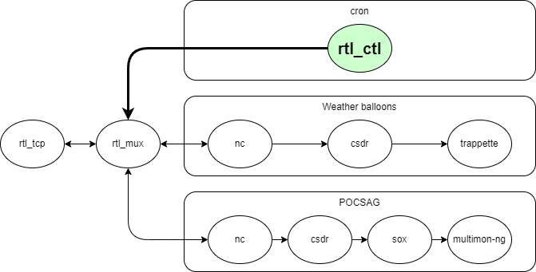

rtl-ctl
===
Simple rtl_tcp SDR client

`rtl_ctl` allows user to "set" `rtl_tcp` server central frequency.  
Typical usage is found when using [rtlmux](https://github.com/slepp/rtlmux) and listening different bands over the day.

Workflow
--


Compilation
--
```
git clone https://github.com/Quadricopter/rtl-ctl.git  
cd rtl-ctl  
make
```

Usage by example
--
Set **401.5 MHz** central frequency and a **2.4 MHz** sampling rate ( weather-balloon bands )  
```
rtl_ctl -a rtl_tcp-host-ip -p 1234 -f 401500000 -g 2400000
```
Set **446.5 MHz** central frequency ( POCSAG )  
```
rtl_ctl -a rtl_tcp-host-ip -p 1234 -f 446500000
```
